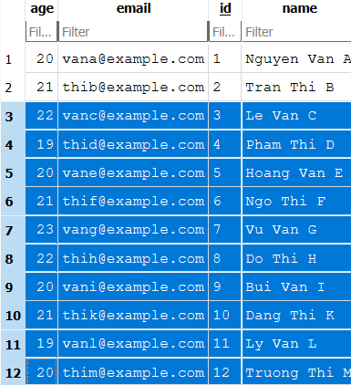
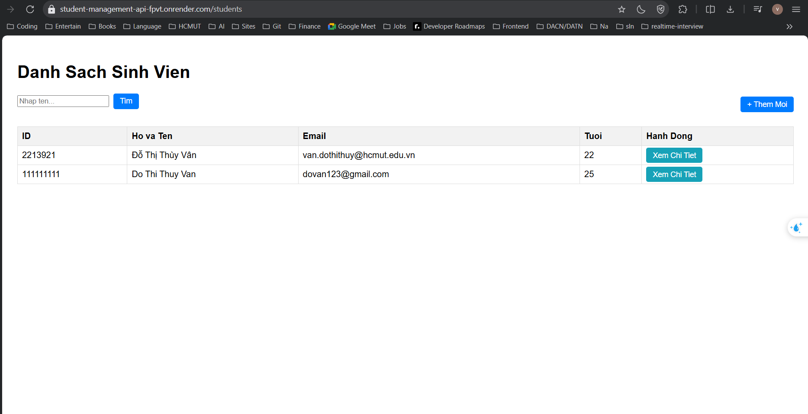
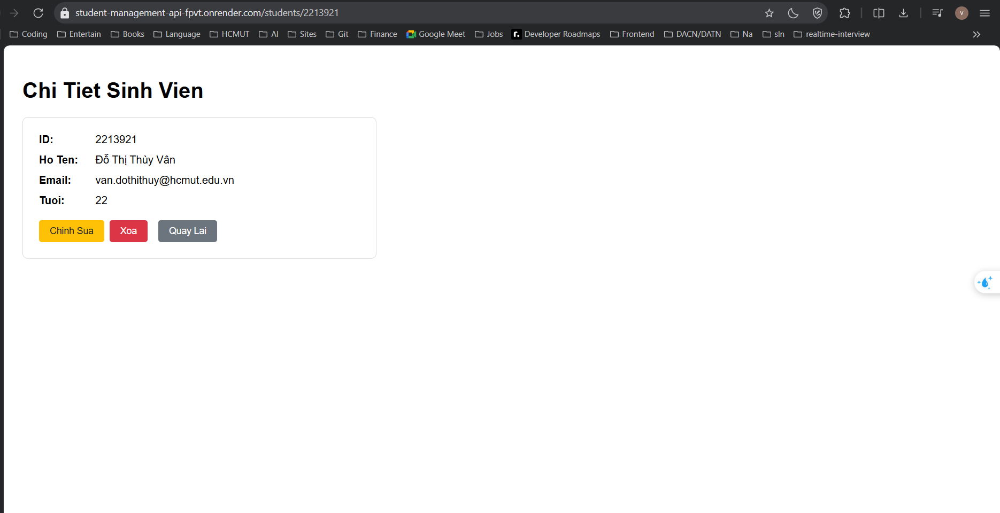
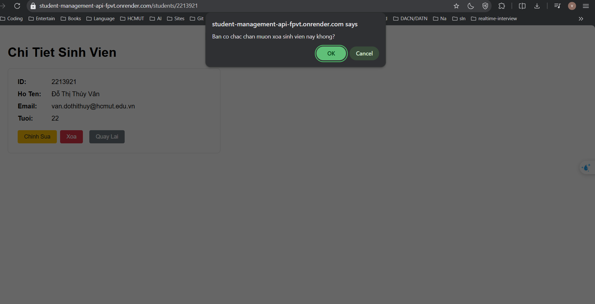
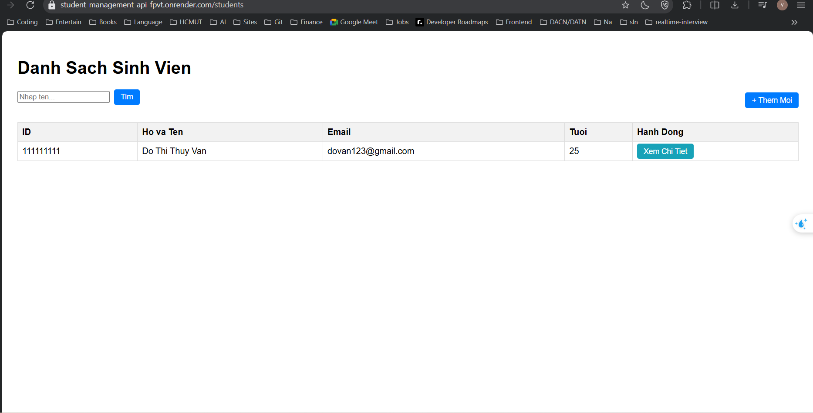
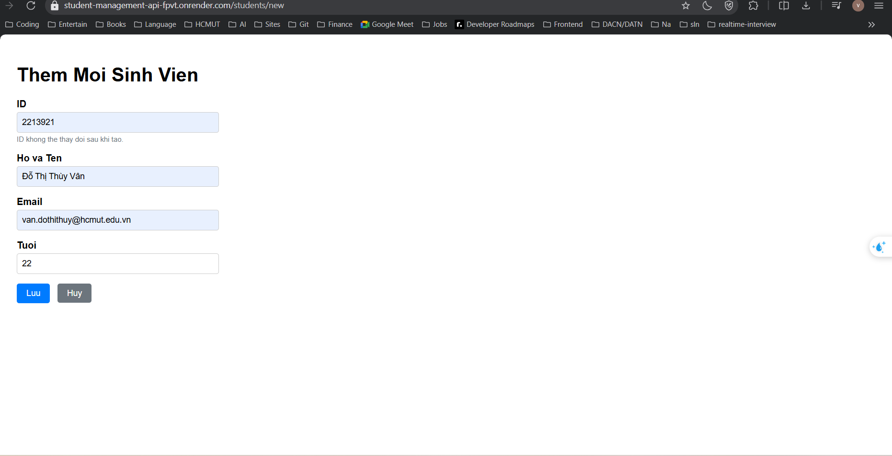
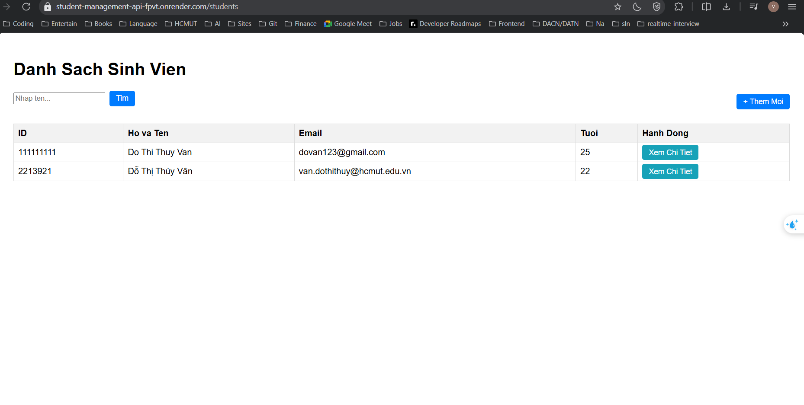
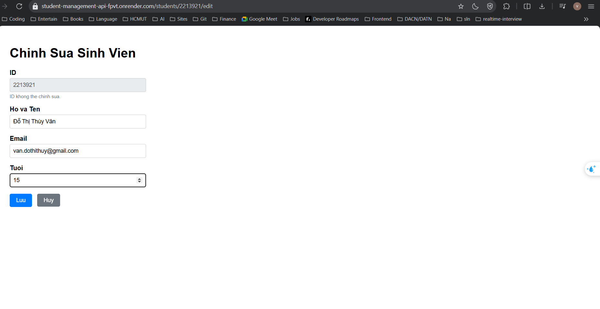
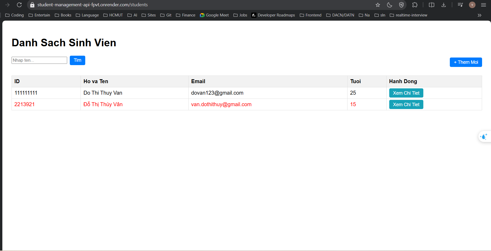

# Student Management System

## Danh Sách Nhóm

| STT | Họ và Tên | MSSV |
|-----|-----------|------|
| 1   | Đỗ Thị Thùy Vân | 2213921 |

---

## Public URL của Web Service
`https://student-management-api-fpvt.onrender.com/students`
---

## Hướng Dẫn Chạy Dự Án

### Yêu Cầu

- Java Development Kit (JDK) 17
- PostgreSQL 17
- Docker Engine (Tải về tại https://docs.docker.com/engine/install/)

---

#### Bước 1: Clone dự án

```bash
git clone https://github.com/ThuyVan032004/hcmut-cnpmnc.git
cd hcmut-cnpmnc
```

#### Bước 2: Tạo file `.env` ở thư mục gốc

```env
# PostgreSQL Database Configuration
POSTGRES_HOST=localhost
POSTGRES_PORT=5432
POSTGRES_DB=student_management
POSTGRES_USER=postgres
POSTGRES_PASSWORD=postgres

# Spring Datasource (su dung cac bien tren)
DATABASE_URL=jdbc:postgresql://${POSTGRES_HOST}:${POSTGRES_PORT}/${POSTGRES_DB}
DB_USERNAME=${POSTGRES_USER}
DB_PASSWORD=${POSTGRES_PASSWORD}
```

#### Bước 3: Tạo database PostgreSQL

```sql
CREATE DATABASE student_management;
```

#### Bước 4: Chạy ứng dụng

```bash
./mvnw spring-boot:run
```

#### Bước 5: Truy cập web UI tại [http://localhost:8080/students](http://localhost:8080/students)
---

## Câu Trả Lời Lý Thuyết

### Lab 1

#### 1. Hãy thử thêm ít nhất 10 sinh viên nữa.
SQL query: 
```sql
    INSERT INTO students (id, name, email, age) VALUES 
    (3, 'Le Van C', 'vanc@example.com', 22),
    (4, 'Pham Thi D', 'thid@example.com', 19),
    (5, 'Hoang Van E', 'vane@example.com', 20),
    (6, 'Ngo Thi F', 'thif@example.com', 21),
    (7, 'Vu Van G', 'vang@example.com', 23),
    (8, 'Do Thi H', 'thih@example.com', 22),
    (9, 'Bui Van I', 'vani@example.com', 20),
    (10, 'Dang Thi K', 'thik@example.com', 21),
    (11, 'Ly Van L', 'vanl@example.com', 19),
    (12, 'Truong Thi M', 'thim@example.com', 20);
```



#### 2. 
    • Cố tình Insert một sinh viên có id trùng với một người đã có sẵn.
    • Quan sát thông báo lỗi: UNIQUE constraint failed. Tại sao Database lại chặn
    thao tác này?

Trong cấu trúc bảng, cột id được định nghĩa là PRIMARY KEY, dùng để định danh duy nhất cho mỗi hàng trong bảng. Nó bắt buộc dữ liệu tại cột đó không được phép trùng lặp (Unique) và không được để trống (Not Null).
=> Đảm bảo tính toàn vẹn dữ liệu, gây sai lệch khi truy vấn hoặc cập nhật.

#### 3. 
    • Thử Insert một sinh viên nhưng bỏ trống cột name (để NULL).
    • Database có báo lỗi không? Từ đó suy nghĩ xem sự thiếu chặt chẽ này ảnh hưởng gì khi code Java đọc dữ liệu lên?

- Nếu thực hiện INSERT một sinh viên và để trống cột name (NULL), Database SQLite sẽ không báo lỗi vì cột name chỉ được định nghĩa là TEXT mà không đi kèm ràng buộc NOT NULL.
- Ảnh hưởng khi code Java đọc dữ liệu:
    * Khi ứng dụng Java sử dụng JPA để ánh xạ dữ liệu từ Database lên Object (Entity), giá trị NULL từ cột name sẽ được gán vào thuộc tính String trong Java.
    * Nếu code logic không kiểm tra kỹ (Null Check) trước khi xử lý (ví dụ: gọi hàm .toUpperCase() trên tên sinh viên hoặc hiển thị lên giao diện), ứng dụng sẽ phát sinh lỗi NullPointerException, dẫn đến sập ứng dụng hoặc lỗi hệ thống.

#### 4. Tại sao mỗi lần tắt ứng dụng và chạy lại, dữ liệu cũ trong Database lại bị mất hết?
- Do cấu hình trong file application.properties tại dòng: spring.jpa.hibernate.ddl-auto=create.
=> Hibernate thực hiện quy trình: Xóa bỏ các bảng cũ (Drop) và Tạo lại bảng mới (Create) mỗi khi ứng dụng Spring Boot được khởi chạy.
- Cách khắc phục: chuyển cấu hình này thành update (chỉ cập nhật cấu trúc, giữ nguyên dữ liệu) hoặc none (không can thiệp vào cấu trúc bảng).

## Screenshots (Lab 4)

### 1. Danh Sách Sinh Viên



---

### 2. Chi Tiết Sinh Viên


---

### 3. Xoá Sinh Viên



---

### 4. Thêm mới Sinh Viên



---

### 5. Chỉnh sửa Sinh Viên



---
